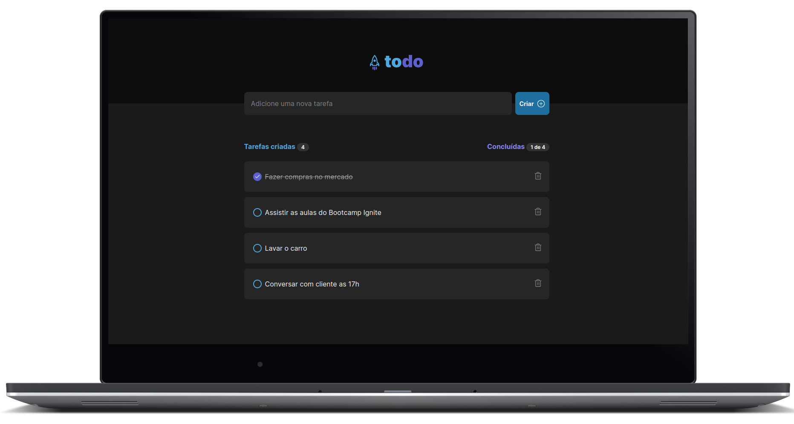
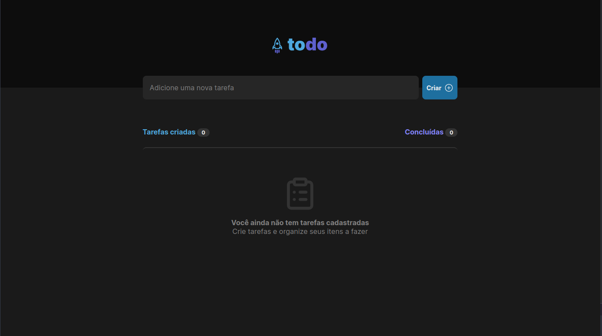
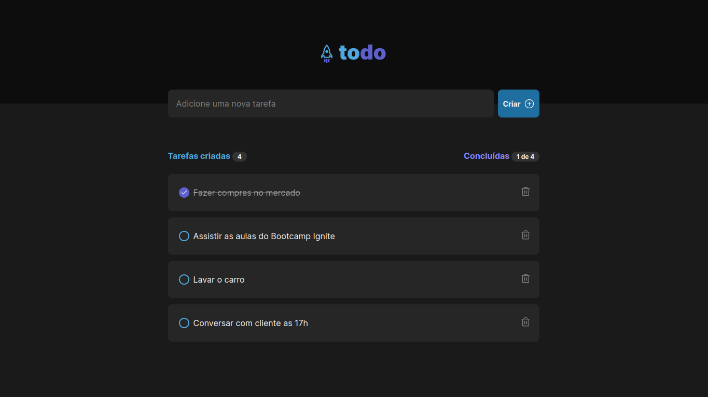

<h1 align="center">
    
</h1>

<div align="center">

   [](LICENSE.md) 
    
   
   
   
  
  
    
<br>

<p align="center">
  <strong>
      <a href="#-Preview">Preview</a> &nbsp;|&nbsp; 
  </strong>
  <strong>
      <a href="#-projeto">Projeto</a> &nbsp;|&nbsp; 
  </strong>
  <strong>
      <a href="#-layout">Layout</a> &nbsp;|&nbsp; 
  </strong>
  <strong>
      <a href="#-tecnologias">Tecnologias</a> &nbsp;|&nbsp; 
  </strong>
  <strong>
      <a href="#-como-executar-o-projeto">Executando</a> &nbsp;|&nbsp; 
  </strong>
  <strong>
      <a href="#-referências">Referências</a> &nbsp;|&nbsp; 
  </strong>
  <strong>
      <a href="#-autor">Autor</a> 
  </strong>
</p>

<p align="center">
  
</p>
</div>


## **✨ Preview**
#### Sistema Online: https://todoawesome.vercel.app 
---

## **💻 Projeto**
Um projeto desenvolvido durante o <b>Bootcamp Ignite</b> da <b>Rocketseat</b>, o projeto "ToDo" é um projeto basico de listagem de tarefas que pode tanto ser utilizado em trabalho como com coisas do dia a dia, podendo criar tarefas novas confirmar tarefas concluidas e exclui-las tambem.

---

## **🔖 Layout**

Você pode visualizar o layout do projeto no formato através [desse link](https://www.figma.com/file/vMWqtW8Xh45R4WZZXm664d/ToDo-List-%E2%80%A2-Desafio-React-JD?type=design&node-id=0%3A1&mode=design&t=lmFkeGteDueSB2iJ-1). Lembrando que você irá precisar ter uma conta no [Figma](http://figma.com/).


#### **Web**
<p align="center">
  
  
</p>


---

## **💻 Tecnologias**


 #### **Website** ([React][react])
 
  - **[React][react]**
  - **[Typescript][typescript]**
  - **[Vite][vite]**
  - **[CSS Module][css_module]**
  - **[React Icons][react_icons]**
  - **[React Hot Toast][react_hot_toast]**
  - **[Node v18.16.1][node]**

> \* Veja o arquivo <kbd>[package.json](./package.json)</kbd>

 #### **Utilitários**
 
 - Editor: **[Visual Studio Code][vscode]** 
 - Markdown: **[StackEdit][stackedit]**, **<kbd>[Markdown Emoji][markdown_emoji]</kbd>**

---

##  **🚀 Como executar o projeto**

### Configurações Iniciais

Primeiro, você precisa ter o <kbd>[NodeJS](https://nodejs.org/en/download/)</kbd> instalado na sua máquina. 

Se você estiver utilizando o **Linux**, você pode optar por instalar o **Node** através do gerênciador de versões <kbd>[nvm]</kbd> para caso seja nescessario alterar a sua versão do **Node** para uma versão mais antiga ou mais nova.

Você pode optar também por utilizar o **yarn** no lugar do **npm**. Você pode instalar clicando nesse <kbd>[link][yarn]</kbd>.

Após ter o **Node** instalado, instale as dependências do **React** contidas nos arquivos `package.json` que se encontram na raíz do repositório. Para instalar as dependências, basta abrir o terminal no diretório e digitar o comando:

```sh
$ npm install

# ou

$ yarn
```

> Veja a parte de **scripts {}** do arquivo <kbd>[package.json](./package.json)</kbd> para saber quais scripts estão disponíveis.


### Executando o WebSite

```sh
# Executando o website no modo de desenvolvimento:
$ npm run dev

# ou

# Executando o website no modo de desenvolvimento:
$ yarn dev
```
> Se o browser não abrir automaticamente, acesse: http://localhost:5173.

---

## **📚 Referências**

- [Blog Rocketseat](https://blog.rocketseat.com.br/)
- [ReactJS](https://reactjs.org/docs/getting-started.html) | [ReactJS pt-BR](https://pt-br.reactjs.org/docs/getting-started.html)
- [Node](https://nodejs.org/en/)

## **👨‍🚀 Autor**

<a href="https://github.com/jairodoni">
 
 <br />
 <sub><b>Jairo Doni Prudente Junior</b></sub></a>
 <br />

👋 Entre em contato!

[](https://www.linkedin.com/in/jairodoni/)
[](mailto:jairo.doni97@gmail.com)

## **:memo: Licença**

Esse projeto está sob a licença MIT. Veja o arquivo [LICENSE](LICENSE.md) para mais detalhes.


<!-- Website Links -->

[rocketseat_site]: https://rocketseat.com.br/

<!-- Badges -->

[repository_license_badge]: https://img.shields.io/github/license/JairoDoni/NLW-1.0

[web_react_badge]: https://img.shields.io/badge/web-react-blue

[typescript]: https://img.shields.io/badge/types-Typescript-blue

<!-- Techs -->

[react]: https://reactjs.org/

[vite]: https://vitejs.dev

[css_module]: https://github.com/css-modules/css-modules

[react_hot_toast]: https://react-hot-toast.com

[node]: https://nodejs.org/en/

[nvm]: https://github.com/nvm-sh/nvm

[vscode]: https://code.visualstudio.com/

[react_native]: http://www.reactnative.com/

[stackedit]: https://stackedit.io

[markdown_emoji]: https://gist.github.com/rxaviers/7360908

[react_icons]: https://react-icons.github.io/react-icons/

[typescript]: https://www.typescriptlang.org/

[asdf]: https://github.com/asdf-vm/asdf

[yarn]: https://classic.yarnpkg.com/en/docs/install/#debian-stable

[webpack]: https://webpack.js.org
